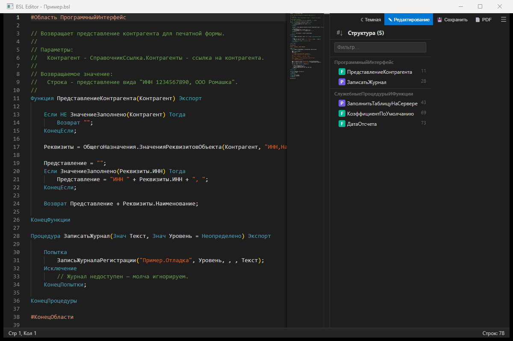
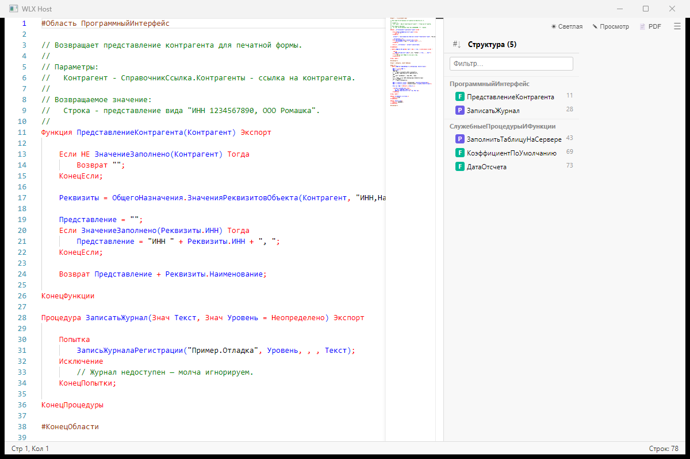
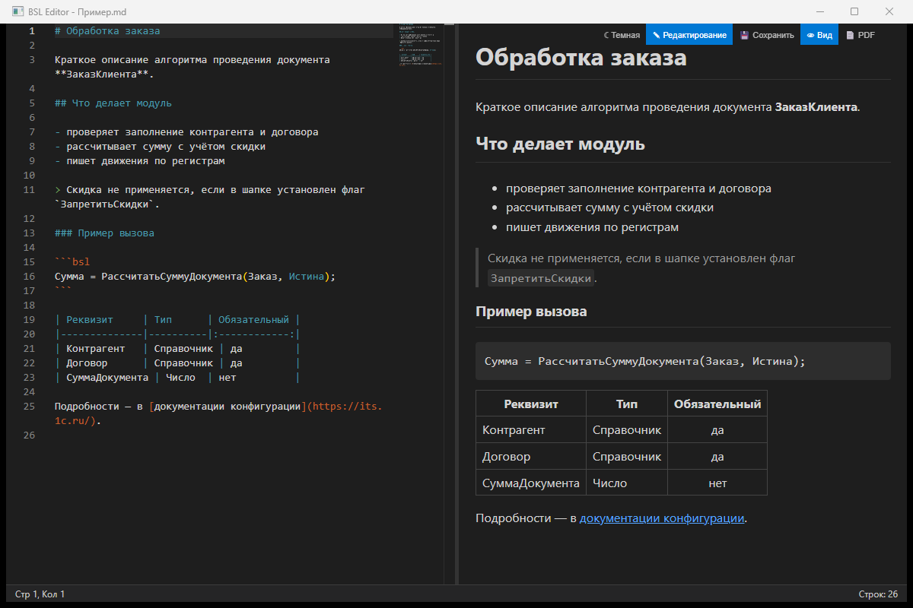
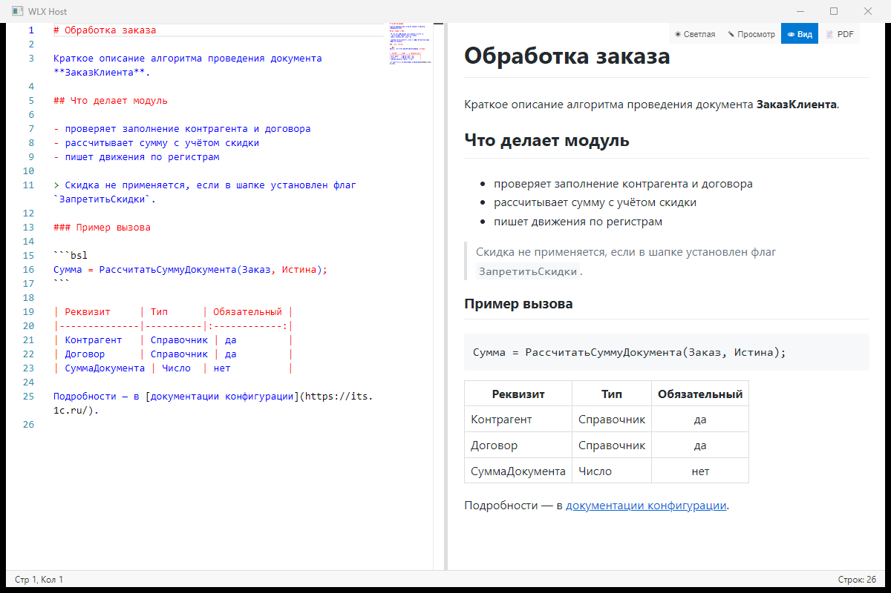
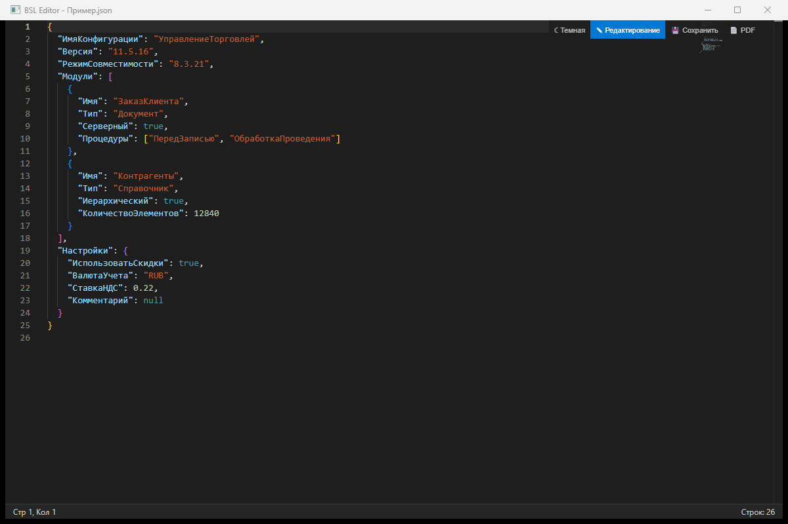
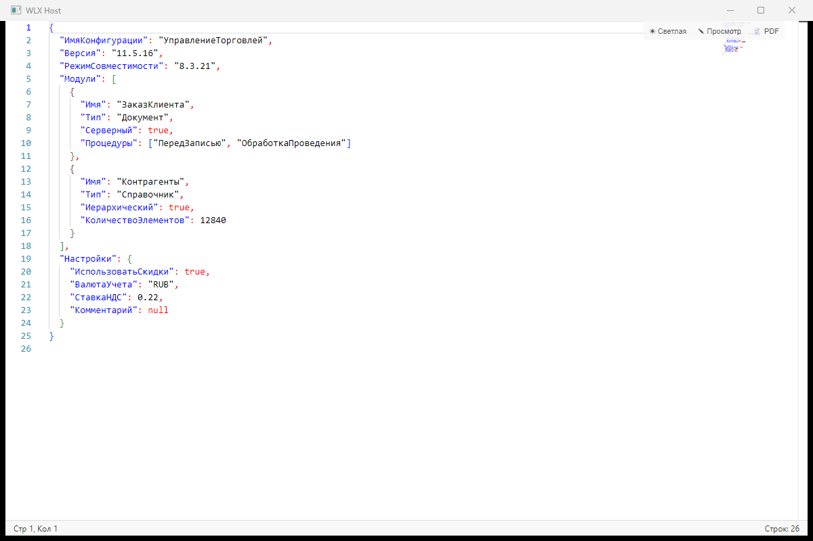
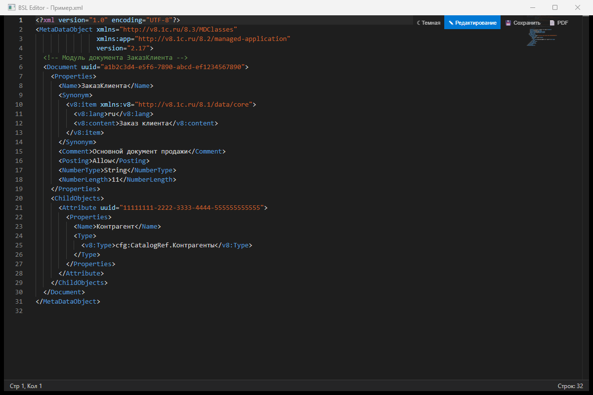
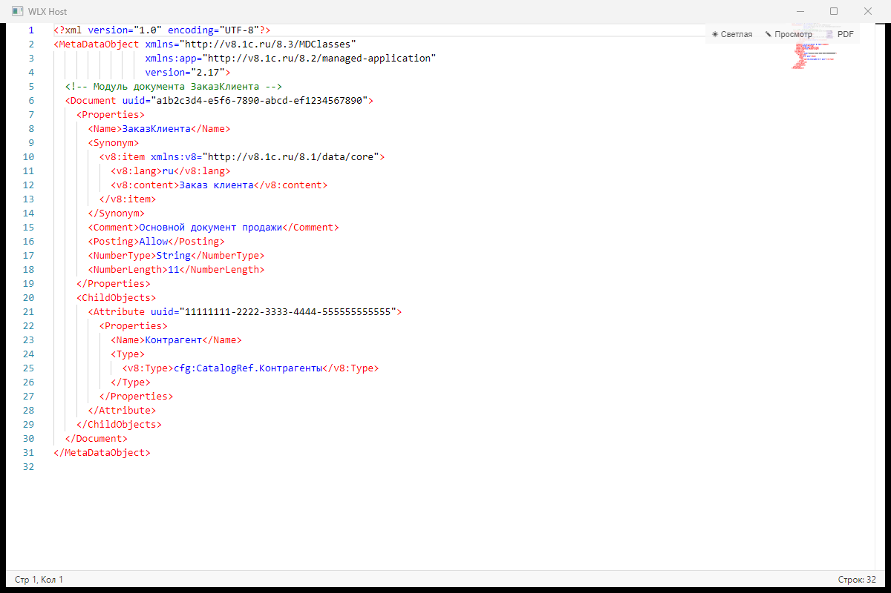

# BSLView - Total Commander Lister Plugin

WLX-плагин для Total Commander, обеспечивающий просмотр и редактирование файлов 1С:Предприятие (.bsl, .os, .sdbl, .query) с подсветкой синтаксиса по нажатию F3.

Использует [Monaco Editor](https://microsoft.github.io/monaco-editor/) (движок VS Code) через WebView2 с полной подсветкой синтаксиса BSL. Monaco поставляется вместе с плагином (папка `web`), интернет не требуется. При отсутствии WebView2 — fallback на встроенный C++ подсветчик через IE.

Цветовая схема подсветки соответствует конфигуратору 1С (на основе проекта [bsl_console](https://github.com/salexdv/bsl_console)).

## Возможности

- **Monaco Editor** с подсветкой синтаксиса BSL/OneScript
- Цветовая схема как в Конфигураторе 1С (светлая тема) и VS Code (темная тема)
- **Панель процедур/функций** (outline) справа с фильтром, сортировкой и изменяемым размером
- **Группировка по областям** (#Область / #Region) в панели процедур
- **Режим редактирования** с сохранением (Ctrl+S)
- **Переключатель темы** (светлая/темная) с автоопределением по настройкам TC
- Двуязычная поддержка (русский + английский синтаксис 1С)
- Minimap (карта кода)
- Нумерация строк, сворачивание блоков (folding)
- Автоопределение кодировки (UTF-8 BOM, UTF-8, UTF-16 LE/BE, Windows-1251)
- Поддерживаемые расширения: `.bsl`, `.os`, `.sdbl`, `.query`, `.md`, `.json`, `.xml` и другие текстовые
- 32-bit и 64-bit версии
- Fallback на C++ подсветчик через IE при отсутствии WebView2

## BSLEdit - автономный редактор

В комплекте идет **BSLEdit.exe** — автономный редактор BSL файлов на базе Monaco Editor:

- Открытие файлов через командную строку или диалог выбора файла
- Автоматическая ассоциация с файлами `.bsl` и `.os` при первом запуске; путь в реестре обновляется, если exe переехал
- Автоопределение темы (светлая/темная) по настройкам Windows
- Автоопределение темы (светлая/темная) по настройкам Windows
- Полный набор функций: панель процедур, фильтр, сортировка, редактирование, сохранение

## Скриншоты

Один Monaco-интерфейс в двух оболочках: **BSLEdit** открывает файл в режиме правки и берёт тему Windows, **Lister (F3)** открывает тот же файл на просмотр и берёт тему Total Commander.

### BSL (`.bsl`) — подсветка как в Конфигураторе 1С

Светлая тема: ключевые слова красные, идентификаторы синие, комментарии зелёные. Тёмная: ключевые слова бирюзовые, строки оранжевые.

**BSLEdit** (правка, тёмная тема)



**Lister F3** (просмотр, светлая тема)



### Markdown (`.md`) — исходник слева, превью справа

**BSLEdit**



**Lister F3**



### JSON (`.json`)

**BSLEdit**



**Lister F3**



### XML (`.xml`)

**BSLEdit**



**Lister F3**



## Сборка

### Требования

- Visual Studio 2022 Build Tools (или полная VS 2022)
- Компонент "Desktop development with C++"
- Windows SDK 10.0
- WebView2 SDK (включен в репозиторий как `webview2sdk/`)

### Компиляция

```batch
build.bat
```

При первом запуске скрипт сам скачает Monaco в `web\vs` (см. `tools\fetch-monaco.ps1`).
Скрипт соберет:
- `BSLView.wlx` — 32-bit плагин для Total Commander
- `BSLView.wlx64` — 64-bit плагин для Total Commander
- `BSLEdit.exe` — 64-bit автономный редактор

### Тесты

```batch
tools\run-tests.bat
```

Проверяют определение кодировки, побайтовый round-trip при сохранении и JSON-экранирование.

### Замеры производительности

```batch
powershell -File tools\bench-plugin.ps1
```

Прогоняет `.wlx64` через `tools\wlxhost.cpp` — минимальную замену Lister'а — и
измеряет задержку до отрисовки после `ListLoad`.

### Структура проекта

| Файл | Описание |
|------|----------|
| `main.cpp` | Точка входа WLX-плагина, экспорты API Lister |
| `bsledit.cpp` | Точка входа BSLEdit.exe |
| `bslcommon.cpp/h` | Чтение/запись файлов с сохранением кодировки, JSON-экранирование |
| `webview2host.cpp/h` | Обертка над WebView2: общее окружение, пул прогретых экземпляров |
| `web/viewer.html/css/js` | Интерфейс редактора: Monaco, токенизатор BSL, панель структуры |
| `web/vs/` | Monaco Editor (скачивается, не хранится в репозитории) |
| `browserhost.cpp/h` | Обертка над IE WebBrowser (fallback) |
| `bslhighlight.cpp/h` | C++ подсветчик BSL для IE fallback |
| `BSLView.ini` | Конфигурация плагина |
| `build.bat` | Скрипт сборки |
| `exports.def` | DEF-файл экспортов DLL |

## Установка плагина

### Автоматическая (рекомендуется)

1. Скачайте `BSLView.zip` из [Releases](../../releases)
2. Откройте архив в Total Commander — установка предложится автоматически

### Из локальной сборки

Закройте Total Commander (при выходе он перезаписывает `wincmd.ini` из памяти) и выполните:

```powershell
powershell -ExecutionPolicy Bypass -File tools\install-tc.ps1 -TcDir "C:\Path\To\Total Commander"
```

Скрипт копирует плагин вместе с папкой `web`, регистрирует его в `wincmd.ini` (обновляя
существующую запись, если она есть, — дубликат не создается) и сохраняет резервную копию
в `wincmd.ini.bak`. Уже имеющийся `BSLView.ini` не затирается: в него дописываются только
отсутствующие ключи. Скрипт рассчитан на повторные запуски после каждой пересборки.

`-TcDir` лучше указывать явно: без него путь берется из запущенного процесса или реестра,
а там может быть прописана другая установка.

Total Commander перебирает lister-плагины в порядке их номеров в `wincmd.ini`, поэтому плагин,
объявивший то же расширение раньше, перехватит файл. Чтобы поднять BSLView выше конкурентов:

```powershell
powershell -ExecutionPolicy Bypass -File tools\install-tc.ps1 -TcDir "..." -PromoteBefore "MarkdownView,XMLReview"
```

### Ручная

1. Скопируйте файлы в папку `%COMMANDER_PATH%\plugins\wlx\BSLView\`:
   - `BSLView.wlx` (32-bit) и/или `BSLView.wlx64` (64-bit)
   - `BSLView.ini`
   - папку `web` целиком — без нее плагин откатится на IE-подсветку
2. В Total Commander: Configuration -> Options -> Plugins -> Lister (WLX)
3. Нажмите "Add" и выберите `BSLView.wlx` / `BSLView.wlx64`

Total Commander кэширует строку распознавания расширений в `wincmd.ini` (`N_detect=`) и не
перечитывает ее из плагина. Если вы меняли списки расширений в `BSLView.ini`, переустановите
плагин в TC или поправьте `N_detect` вручную.

## Установка BSLEdit

1. Скачайте `BSLEdit.zip` из [Releases](../../releases)
2. Распакуйте `BSLEdit.exe` в любую папку
3. При первом запуске программа автоматически зарегистрирует ассоциацию файлов `.bsl` и `.os`

## Настройка

Настройки плагина хранятся в `BSLView.ini` рядом с плагином:

```ini
[Options]
FontFamily=Consolas, Courier New, monospace
FontSize=14
TabSize=4
LineNumbers=1
Theme=auto       ; auto (по настройкам TC), light, dark
UseMonaco=1      ; 1 = Monaco Editor, 0 = IE fallback
MaxFileSizeMB=64 ; файлы крупнее отдаются встроенному просмотрщику TC
KeepWarm=1       ; держать один экземпляр WebView2 между файлами

[Extensions]
BSLExtensions=bsl;os
QueryExtensions=sdbl;query
TextExtensions=md;markdown;json;xml;ps1;psm1;psd1;html;htm
```

`KeepWarm=1` — главный параметр скорости: плагин держит один прогретый экземпляр
WebView2 с уже загруженным Monaco, поэтому F3 открывает файл примерно за полсекунды
вместо нескольких секунд. Ценой примерно 150 МБ памяти; поставьте `0`, если память
важнее скорости.

`[Extensions]` управляет и строкой определения типов, которую плагин отдает Total
Commander, так что добавленное сюда расширение начнет обрабатываться после перезапуска TC.

## Подсвечиваемые элементы

| Элемент | Примеры |
|---------|---------|
| Ключевые слова | `Если`/`If`, `Тогда`/`Then`, `Процедура`/`Procedure`, `Возврат`/`Return` |
| Комментарии | `// комментарий` |
| Строки | `"текст"`, многострочные с `\|` |
| Числа | `123`, `3.14` |
| Даты | `'20250101'` |
| Препроцессор | `#Область`/`#Region`, `#Если`/`#If` |
| Аннотации | `&НаСервере`/`&AtServer`, `&НаКлиенте`/`&AtClient` |
| Константы | `Истина`/`True`, `Ложь`/`False`, `Неопределено`/`Undefined`, `NULL` |

## Зависимости

- [WebView2](https://developer.microsoft.com/en-us/microsoft-edge/webview2/) — для Monaco Editor (обычно уже установлен с Windows 10/11)
- [Monaco Editor](https://microsoft.github.io/monaco-editor/) — загружается с CDN при первом открытии

## Лицензия

MIT
